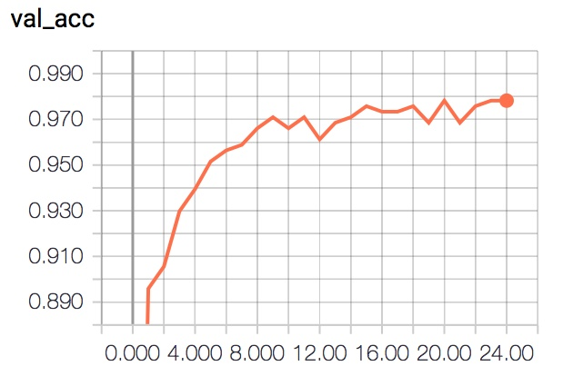
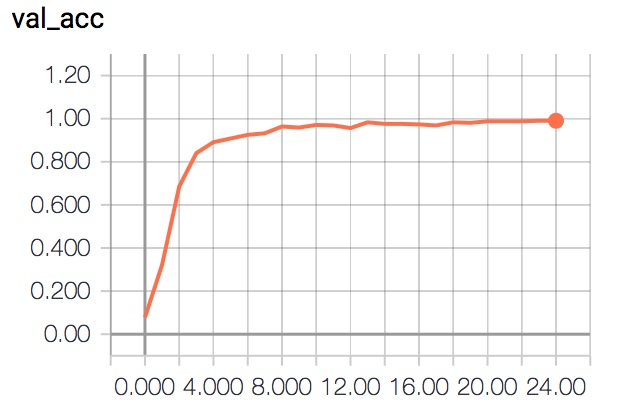

# Vocalize Sign Language
### By Arda Mavi

Vocalization sign language with deep learning.

In this project we use our own `Sign Language Dataset`.

Vocalization sign language iOS App: [Vocalization-Sign-Language-iOS](https://github.com/ardamavi/Vocalization-Sign-Language-iOS)

|Demo|
|:-:|
||
|[Watch Demo Videos &#128266; ](https://github.com/ardamavi/Vocalize-Sign-Language/blob/master/Assets)|

# Contents:
[For Users](#for-users)
- [Important Notes For Users](#important-notes-for-users)
- [Additional Info](#additional-info)
- [Running Program](#running-program)

[For Developers](#for-developers)
- [Getting Dataset](#getting-dataset)
- [Artificial Intelligence Model Accuracy](#artificial-intelligence-model-accuracy)
- [Model Architecture](#model-architecture)
- [Model Training](#model-training)
- [Using Tensorboard](#using-tensorboard)
- [Creating Dataset](#creating-dataset)

! [Important Notes](#important-notes)

# For Users:

### Important Notes For Users:
- This project works best in the white background and good light.

### Additional Info:
<b>In this project, I added deep learning to my old lip reading project [SesimVar](https://github.com/ardamavi/SesimVar)(Turkish).</b>

## Running program:
Note: If you are failed, look up `For Development` title in bellow.

### Using Live Vocalize Command:
`python3 live.py`
Note: If you want, you can change the delay time.

### Using Predict Command:
`python3 predict.py <ImageFileName>`

# For Developers:

## Getting Dataset:
`cd Data && chmod +x download_dataset.sh && ./download_dataset.sh`

### New `DataSet` and `Updated Model` coming soon!

|Demo|
|:-:|
||
|[Watch Demo Videos &#128266; ](https://github.com/ardamavi/Vocalize-Sign-Language/blob/master/Assets)|

|Model Accuracy|
|:-:|
||

#### Dataset:
In this project we use our own [Sign Language Digits Dataset](https://github.com/ardamavi/Sign-Language-Digits-Dataset).

#### Dataset Preview:

### Artificial Intelligence Model Accuracy:
At the end of 25 epochs, 97% accuracy was achieved in the test without data augmentation:

 
At the end of 25 epochs, 99% accuracy was achieved in the test with data augmentation:

### Model Architecture:
- Input Data
Shape: 64x64x1

- Convolutional Layer
32 filter
Filter shape: 3x3
Strides: 1x1
Padding: Same

- Activation
Function: ReLu

- Convolutional Layer
64 filter
Filter shape: 3x3
Strides: 1x1
Padding: Same

- Activation
Function: ReLu

- Max Pooling
Pool shape: 2x2
Strides: 2x2

- Convolutional Layer
64 filter
Filter shape: 3x3
Strides: 1x1
Padding: Same

- Activation
Function: ReLu

- Max Pooling
Pool shape: 2x2
Strides: 2x2

- Convolutional Layer
128 filter
Filter shape: 3x3
Strides: 1x1
Padding: Same

- Activation
Function: ReLu

- Max Pooling
Pool shape: 2x2
Strides: 2x2

- Flatten

- Dense
Size: 526

- Activation
Function: ReLu

- Dropout
Rate: 0.5

- Dense
Size: 128

- Activation
Function: ReLu

- Dropout
Rate: 0.5

- Dense
Size: Class size in dataset

- Activation
Function: Softmax

##### Optimizer: Adadelta
##### Loss: Categorical Crossentropy

Total params: 4,507,864 
Trainable params: 4,507,864 
Non-trainable params: 0

### Model Training:
`python3 train.py`

Not forget to [download dataset](#getting-dataset) before training!

### Using TensorBoard:
`tensorboard --logdir=Data/Checkpoints/logs`

### Creating Dataset:
For getting dataset look up [Getting Dataset](#getting-dataset) title in this file.

For your own dataset:
- Create 'Data/Train_Data' folder.
- Create folder in 'Data/Train_Data' folder and rename what you want to add char or string.
- In your created char or string named folder add much photos about created char or string named folder.
Note: We work on 64x64 image also if you use bigger, program will automatically return to 64x64.

### Important Notes:
- Used Python Version: 3.6.0
- Install necessary modules with `sudo pip3 install -r requirements.txt` command.
- Install OpenCV (We use version: 3.2.0-dev)
